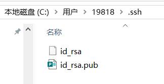

# Git学习笔记

## Chapter01 认识Git

### 1.1 集中式版本控制系统

例如：CVS、SVN

版本库集中存放在【中央服务器】，工作时要先从中央服务器取得最新的版本，工作结束再将结果推送给中央服务器——<u>图书馆</u>

> 集中式版本控制系统最大的问题就是需要联网工作

### 1.2 分布式版本控制系统

例如：Git

分布式版本控制系统没有中央服务器，每个人的电脑中有完整的版本库，在多人协作时，只需要给对方推送【修改记录】即可，<u>安全性</u>要高很多

分布式版本控制系统有一台充当【中央服务器】的电脑，只不过它仅仅是用来方便“交换”大家的修改记录

## Chapter02 安装Git

[Git安装详解-CSDN](https://blog.csdn.net/qq_45730223/article/details/131693287?ops_request_misc=%257B%2522request%255Fid%2522%253A%25225a8cb291a285e90c3a4043f3aefd2182%2522%252C%2522scm%2522%253A%252220140713.130102334..%2522%257D&request_id=5a8cb291a285e90c3a4043f3aefd2182&biz_id=0&utm_medium=distribute.pc_search_result.none-task-blog-2~all~top_positive~default-1-131693287-null-null.142^v102^control&utm_term=Git%E5%AE%89%E8%A3%85&spm=1018.2226.3001.4187)

[安装Git - Git教程 - 廖雪峰的官方网站](https://liaoxuefeng.com/books/git/install-git/index.html)

### 2.1 Git全局用户名称和电子邮件地址

```c
// 设置
$ git config --global user.name "Your Name"
$ git config --global user.email "email@example.com"
// 查看
$ git config --global user.name
$ git config --global user.email
```

## Chapter03 创建版本库

### 3.1 创建方法

版本库又名**仓库（Repository）**，这个目录里面的所有文件都可以被Git管理起来，每个文件的修改、删除，Git都能跟踪，以便任何时刻都可以追踪历史，或者在将来某个时刻可以**“还原”**

```
$ mkdir MyNotebooks
$ cd MyNotebooks
$ pwd
/d/Desktop/MyNotebooks
```

通过【git init】命令把这个目录变成Git可以管理的仓库


自此之后，当前目录下多了一个【.git】的目录，这个目录是Git来跟踪管理版本库的，<u>不要随意修改其中内容，可能会破坏Git仓库</u>

> 如果你没有看到`.git`目录，那是因为这个目录默认是隐藏的，用`ls -ah`命令就可以看见
>
> 

### 3.2 把文件添加到版本库

【注意】：所有的版本控制系统，只能跟踪【文本文件】的改动，如TXT、网页和代码等，对于【图像、视频】这一类<u>二进制文件</u>是无法跟踪的

> [!WARNING]
>
> 不幸的是，**Microsoft的Word格式是二进制格式**，因此Git是没法跟踪Word文件的改动的
>
> 千万不要使用**Windows自带的记事本**编辑任何文本文件。原因是Microsoft开发记事本的团队使用了一个非常弱智的行为来保存UTF-8编码的文件，他们自作聪明地在每个文件开头添加了0xefbbbf（十六进制）的字符
>
> 建议下载VS Code来代替记事本

**<u>eg：编写一个readme.txt文件，并将该文件放到仓库</u>**


```C
$ vi readme.txt
//git add把文件添加到仓库
$ git add readme.txt
//git commit把文件提交到仓库，-m是关于本次提交的说明
$ git commit -m "wrote a readme file"
```

显然，git commit命令执行成功后会告诉我两个信息，① 1 file changed：1个文件被改动（我们新添加的readme.txt文件）；② 1 insertions：插入了一行内容（readme.txt有一行内容）

> 【补充内容】Git 使用vi或vim命令打开、关闭、保存文件、
>
> 1.vi & vim两种工作模式
> 命令模式：接受、执行操作命令，打开文件后的默认模式（如【:wq指令】）
> 编辑模式：对打开文件的内容进行增删改操作（如对txt文件进行编辑）
> >键盘输入字母 “i”或“Insert”键进入最常用的插入编辑模式
>
> 2.创建，打开文件 —— $ vi [filename]
> 如果文件存在则打开现有文件，如果文件不存在则【新建文件】，并在终端最下面一行显示打开的是一个新文件
>
> 3.保存文件
> 在编辑模式下编辑文件，按下【ESC】键，回退到命令模式，在命令模式下键入 【:wq】 保存并退出vi，键入【:w】 仅保存文件

## Chapter04 时光穿梭机

目前已经通过【vi readme.txt】指令在当前目录下新建了readme.txt文件，如果再对其内容进行修改，然后运行【git status】掌握当前仓库状态：

```C
$ git status
// 目前的分支branch是master
On branch master
// 已经有文件发生了变化，但是这些更改还没有被加入暂存区（staging area）
// 可以选择使用【git add】指令将更改添加到暂存区，也可以使用【git checkout】指令放弃当前的更改
Changes not staged for commit:
  (use "git add <file>..." to update what will be committed)
  (use "git checkout -- <file>..." to discard changes in working directory)

// 发生更改的文件是 readme.txt
	modified:   readme.txt

// 表示目前没有任何更改被加入到暂存区，因此无法进行提交，提供了两种解决方案
no changes added to commit (use "git add" and/or "git commit -a")
```

虽然【git status】指令可以返回给我们当前仓库的状态，但是想要知道具体的更改内容，需要使用【git diff】指令

更改结束后，使用【git add】指令将内容提交到暂存区，此时使用【git status】指令会返回给我们将要提交的修改文件是什么，再使用【git commit】指令即可提交到仓库

### 4.1 版本回退

当你觉得文件修改到一定程度的时候，就可以“保存一个【快照】”，这个快照在Git中被称为【commit】。
一旦出现文件改乱、误删了文件的情况，还可以从最近的一个commit恢复，然后继续工作，而不至于丢弃工作成果。

eg：
版本1 create a readme.txt and say "hello world"
版本2 clear all content
版本3 say "hello mjj"

【git log】命令查看：


如果嫌输出信息太多，看得眼花缭乱的，可以试试加上【--pretty=oneline】参数


> [!IMPORTANT]
>
> 前面一大串内容是【commit id（版本号）】，与SVN不一样，Git的commit id不是1，2，3……递增的数字，而是一个SHA1计算出来的一个非常大的数字，用十六进制表示，这是因为Git是分布式版本控制系统，在实际工作中还有很多人要参与仓库的管理，因此如果都用1，2，3....这样的数字作为【版本号】，肯定会冲突

**如何将版本回退到“clear all content”？**
首先，要知道当前的commit id版本号【HEAD】，即5d9c01...这一串内容，则上一个版本就是【HEAD^】，上上个版本就是【HEAD^^】，要将版本回退到“clear all content”时，使用【git reset】指令：


【参数传递】：--hard 会回退到上个版本的已提交状态，而 --soft 会回退到上个版本的未提交状态，--mixed 会回退到上个版本已添加但未提交的状态

此时再查看readme.txt文件时，其中的内容就为空了，因为已经退回了之前的版本

> [!IMPORTANT]
>
> 此时再使用【git log】指令时，会发现原先的最新版本号已经不存在了，如果想再回到刚才的最新版本，需要用到其对应的【commit id】，如果找不到了的话，Git还提供了【git reflog】指令来找到所有的版本号

### 4.2 工作区和暂存区

工作区（Working Directory）：可见的目录
版本库（Repository）：隐藏目录.git

>Git的版本库里存了很多东西，其中最重要的就是称为stage的暂存区，还有Git为我们自动创建的第一个分支master，以及指向master的一个指针叫HEAD
>
>

暂存区（Stage）：【git add】指令将文件的更改信息添加到暂存区（或许有多个），【git commit】指令将暂存区中的所有修改提交到分支

```C
//修改文件readme.txt，创建文件LICENSE
$ vi readme.txt
$ vi LICENSE
//没有使用【git add】指令将两份修改添加到暂存区，此时使用【git status】，会显示 Changes not staged for commit
$ git status
On branch master
Changes not staged for commit:
  (use "git add <file>..." to update what will be committed)
  (use "git checkout -- <file>..." to discard changes in working directory)

	modified:   readme.txt

Untracked files:
  (use "git add <file>..." to include in what will be committed)

	LICENSE

no changes added to commit (use "git add" and/or "git commit -a")

//但执行两次【git add】操作后，再看仓库状态
$ git add readme.txt
$ git add LICENSE
$ git status
On branch master
Changes to be committed:
  (use "git reset HEAD <file>..." to unstage)

	new file:   LICENSE
	modified:   readme.txt
//一旦提交后，如果你又没有对工作区做任何修改，那么工作区就是“干净”的
$ git commit -m "understand how stage works"
[master e43a48b] understand how stage works
 2 files changed, 2 insertions(+)
 create mode 100644 LICENSE
$ git status
On branch master
nothing to commit, working tree clean
```

### 4.3 管理修改

> Git优秀于其他版本控制系统的是其【面向修改】而非【面向文件】

如果修改readme.txt文件，追加“new sentence”后使用【git add】将这一次的修改加入暂存区，再次进行修改追加“second sentence”，但此时使用【git commit】时只会把第一次修改的内容提交到仓库，第二次修改的内容并未加入【暂存区Stage】，因此不会一并被提交

此时查看仓库状态会发现“<u>Changes not staged for commit:（修改未被添加到暂存区）</u>”


> 【补充】cat命令用于连接文件并打印到标准输出设备上，它的主要作用是用于查看和连接文件 —— cat [选项] [文件]

### 4.4 撤销修改

1. 修改后还未添加到暂存区 —— 【git checkout -- [filename]】

> 丢弃工作区的修改

在完成了一次文件修改后还未【git add】，即还没有将内容添加到暂存区，此时发现修改有误想要纠正，可以手动修改、版本回退和使用【git checkout -- [filename]】指令<u>丢弃工作区（Working Directory）的修改</u>

也就是说【git checkout -- [filename]】可以让文件回到最近一次【git add】或【git commit】时的状态


【git checkout -- [filename]】命令中的`--`很重要，没有`--`，就变成了“<u>切换到另一个分支</u>”的命令，我们在后面的分支管理中会再次遇到git checkout命令

2. 修改后已经添加到暂存区 —— 【git reset HEAD [filename]】

> 撤销暂存区的修改到工作区，并丢弃工作区的修改

在完成一次文件修改并添加到暂存区时即时发现问题，可以使用【git reset HEAD [filename]】指令<u>把暂存区的修改撤销掉——unstage</u>，重新放回工作区，然后再使用【git checkout -- [filename]】指令丢弃工作区的修改


### 4.5 删除文件

删除文件时存在两种情况：

情况1：使用【rm [filename]】删除文件，工作区和版本库内容不一致，此时使用【git status】会告诉我们哪些文件被删除了，如果确定要删除，则使用【git rm [filename]】在版本库中删除文件，然后使用【git commit】提交修改到仓库


情况2：使用【rm [filename]】删除文件后，发现自己并不想删除，则利用版本库信息回复文件到最新版本【git checkout -- [filename]】

> [!IMPORTANT]
>
> 【git checkout】其实是用版本库里的版本替换工作区的版本，无论工作区是修改还是删除，都可以“一键还原”


> [!WARNING]
>
> 从来没有被添加到版本库就被删除的文件，是无法恢复的！
>
> 

## Chapter05 远程仓库

Git需要一台计算机充当“服务器”，其他每个人都从这个“服务器”仓库克隆一份到自己的电脑上，并且各自把各自的提交推送到服务器仓库里，也从服务器仓库中拉取别人的提交 —— **Github**

**<u>Step1 创建SSH Key</u>**：本地Git仓库和GitHub仓库之间的传输是通过SSH加密的

```shell
$ ssh-keygen -t rsa -C "youremail@example.com"
```


>输入指令后一路回车，顺利的话，可以在用户主目录里找到.ssh目录，里面有id_rsa和id_rsa.pub两个文件，这两个就是SSH Key的秘钥对，id_rsa是私钥，不能泄露出去，id_rsa.pub是公钥
>

Step2 连接Github：在Github中添加SSH Key，填写【id_rsa.pub】文件中的公钥


> 添加成功！


> [!IMPORTANT]
>
> Git支持SSH协议,Github只要知道了公钥，就可以确认只有用户自己才能推送而不是由别人冒充

### 5.1 添加远程库

本地创建了一个【本地Git仓库】后，又想在GitHub创建一个【云端Git仓库】，并且让这两个仓库进行【远程同步】，这样，GitHub上的仓库既可以作为备份，又可以让其他人通过该仓库来协作

目前，在GitHub上的这个【Notebooks仓库】还是空的，GitHub告诉我们，可以从这个仓库克隆出新的仓库，也可以把一个已有的本地仓库与之关联，然后，把本地仓库的内容推送到GitHub仓库


根据Github的提示将【本地仓库】关联到【云端仓库】，然后将本地仓库的所有内容推送到云端仓库中：


从现在起，只要本地作了提交，就可以通过该命令把本地master分支的最新修改推送至GitHub，现在就拥有了真正的分布式版本库：

```shell
$ git push origin master
```

> [!NOTE]
>
> 【删除远程库】如果添加的时候地址写错了，或者就是想删除远程库，可以用【git remote rm  <name>】命令。使用前，建议先用【git remote -v】查看远程库信息

> [!WARNING]
>
> 特别要注意的是，【git init】之后是在工作区生成了版本库【.git】，但此修改还没有添加到暂存区，更没有提交到仓库，此时进行【git remote】和【git push】是连接不到远程库的

